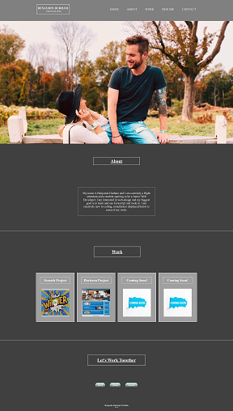
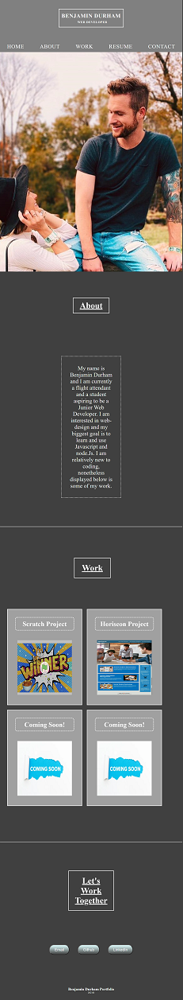
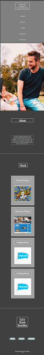

# Benjamin Durham's Professsional Portfolio
1. [ About this Portfolio. ](#about)
2. [ Web Adresses. ](#web-address)
3. [ How to interact with the Portfolio and what to expect!. ](#how-to)
4. [ People who Helped me emotionally. ](#contributions)

## 1. About this Portfolio

This was one of my first times ever building a webpage from scratch. It was a great opportunity to not only test my existing knowledge as well as push me into realms of research, hopelessness, and finally success. It has been a great journey of learning this week. My concept for this page was to achieve a modernized and simple while remaining interesting. I do believe there are areas of vast improvement remaining but I am proud of what I have started.

### 2. You've arrived at Benjamin Durham's Professional portfolio!

You made it! Below you will find a nice little image of my webpage portfolio and links on how to travel there!

### Click link to open in your browser.

[github-pages-site] https://bdurham227.github.io/ProfessionalPortfolio/

[github-repo-site] https://github.com/bdurham227/ProfessionalPortfolio

## 3. How to interact with the Portfolio and what to expect!

I was really interested in incorporating animation into my page. Upon arriving or reloading of the page, you'll see a text box with my name and a sub-heading as well as the navigation links begin to fade in. I tried to stagger their timing. Additionally, the "About" text box on the page fades in too. In the work section you'll find two pictures of projects I have completed and when your mouse hovers over them they will grow in size. Lastly, I wanted to make the contact section a bit more interesting beyond simple links or text. I converted the contact links into buttons that also change in size upon your mouse hovering over them. There is still so much more I would like to achieve in general on this page but I am happy with the progress I have made, the amount I learned, and the potential the lays ahead.

### Here you will see a screenshot of the Navigation bar that will redirect users to the corresponding location on the page that they click to.
Desktop screen:

### Wait...one last thing before you scroll!
It was important for me to make this portfolio a responsive web layout. Below I will attach images. The webpage was designed for mobile, tablet and desktop users alike and the pages layout will change respectively to match each user's preferred or chosen viewing platform.

#### Desktop devices screen example:

#### Tablet screen:

#### Mobile devices screen example:

### Explore the rest of the page by scrolling up or down.

## 4. People who helped me emotionally get Through this:

Thank you to the following for their suggestions, insights, and support:

Gabe Thomas

Jason Barnabel

Stephen Marsh

Patrick Walker

Takuya Matsumoto

